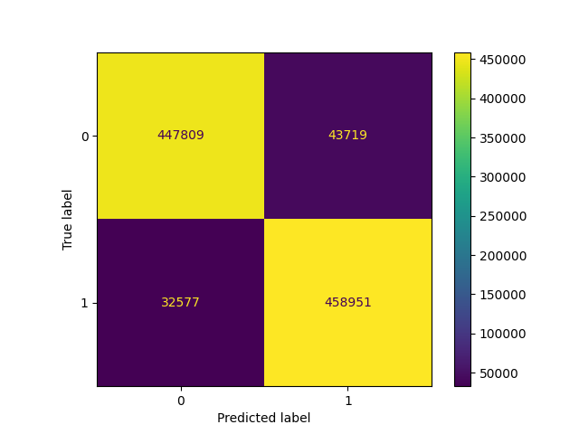

# IDS Bruteforce Detection using Machine Learning
Dataset: [CSE-CIC-IDS2018](https://registry.opendata.aws/cse-cic-ids2018/)
Classification: Random Forest, Support Vector Machine (SVM)

CSE-CIC-IDS2018 (Canadian Institute for Cybersecurity Intrusion Detection Dataset 2018) là một trong những bộ dữ liệu được sử dụng phổ biến trong nghiên cứu về an ninh mạng và phát hiện xâm nhập. Bộ dữ liệu này được tạo ra nhờ sự hợp tác giữa Communications Security Establishment (CSE) và Canadian Institute for Cybersecurity (CIC). Dưới đây là mô tả chi tiết:

**1. Mục tiêu**
CSE-CIC-IDS2018 được thiết kế để cung cấp một bộ dữ liệu toàn diện, tái hiện các kịch bản mạng thực tế bao gồm cả lưu lượng bình thường và các kiểu tấn công phổ biến. Mục tiêu là giúp các nhà nghiên cứu và nhà phát triển hệ thống phát hiện xâm nhập (IDS/IPS) thử nghiệm và đánh giá hiệu quả của các mô hình.

**2. Cấu trúc bộ dữ liệu**

Bộ dữ liệu bao gồm:

Thời gian thu thập: 12-15/02/2018 và 19-23/02/2018.
Môi trường thử nghiệm: Được thiết lập để mô phỏng mạng doanh nghiệp thực, bao gồm người dùng giả lập, các hoạt động dịch vụ (HTTP, HTTPS, FTP, SSH, v.v.), và các kiểu tấn công khác nhau.
Các thành phần dữ liệu:
PCAP files: Lưu trữ toàn bộ lưu lượng mạng (Packet Capture).
Flow-based files: Lưu lượng mạng được trích xuất thành các luồng (flows) và các đặc trưng.
Logs: Ghi nhận hoạt động mạng, hành vi của người dùng giả lập và các sự kiện liên quan.
Dataset CSV: Các file CSV chứa các đặc trưng được trích xuất (đặc trưng về giao thức, thống kê lưu lượng, thông tin về cổng và IP, v.v.).

**3. Loại tấn công**

Bộ dữ liệu bao gồm các loại tấn công phổ biến:

Tấn công mạng:
DoS (Denial of Service)
DDoS (Distributed Denial of Service)
Brute Force (SSH, FTP)
Web Attack (SQL Injection, XSS, Command Injection)
Tấn công MITM (Man-In-The-Middle)
Phishing
Botnet
Infiltration: Xâm nhập hệ thống từ bên trong.
Malware và Backdoor.

**4. Đặc trưng (Features)**

Bộ dữ liệu có hơn 80 đặc trưng trích xuất từ lưu lượng mạng, bao gồm:

Thống kê giao thức: Source IP, Destination IP, Source Port, Destination Port, Protocol.
Đặc trưng dòng (Flow): Flow Duration, Total Fwd Packets, Total Bwd Packets.
Đặc trưng thời gian: Fwd Packet Length Mean, Bwd Packet Length Std.
Đặc trưng TCP: FIN Flag Count, SYN Flag Count, RST Flag Count.
Thống kê tổng hợp: Average Packet Size, Packet Length Variance.

**5. Ứng dụng**

Bộ dữ liệu được sử dụng trong:

Phát triển và đánh giá mô hình phát hiện xâm nhập.
Nghiên cứu học máy (Machine Learning) và học sâu (Deep Learning) trong an ninh mạng.
Phân tích hành vi lưu lượng mạng.
Mô phỏng và kiểm tra trong các hệ thống giám sát an ninh mạng.

**6. Ưu điểm**
Được tạo ra từ môi trường thực tế với các loại tấn công đa dạng và dữ liệu chi tiết.
Bao gồm cả lưu lượng mạng bình thường và lưu lượng mạng bị tấn công, giúp huấn luyện mô hình cân bằng.
Có sẵn ở nhiều định dạng (PCAP, CSV), dễ dàng tích hợp vào các công cụ phân tích.

**7. Nhược điểm**

Dữ liệu lớn, đòi hỏi tài nguyên tính toán cao để xử lý. Có thể chứa các giá trị trùng lặp hoặc mất mát do cấu trúc phức tạp của dữ liệu.
-----------------------------------------------------------------------------------------------------------------------------------------------------------------------
# Phát hiện xâm nhập sử dụng Machine Learning

Dự án này nhằm xây dựng một hệ thống phát hiện xâm nhập (IDS) sử dụng Machine Learning với Random Forest và các kỹ thuật xử lý dữ liệu tiên tiến. Dữ liệu được lấy từ tập IDS Intrusion 2018 và được xử lý, cân bằng lớp, huấn luyện và đánh giá.

---

## Chức năng chính

- **Xử lý dữ liệu**: Làm sạch dữ liệu, chỉnh sửa kiểu dữ liệu, xử lý giá trị vô hạn và thiếu.
- **Biến đổi nhãn**: Tối ưu hóa nhãn mục tiêu để phục vụ mô hình.
- **Cân bằng lớp**: 
    - Đối với mô hình Random Forest: Sử dụng SMOTE để giải quyết vấn đề mất cân bằng dữ liệu.
    - Đối với mô hình Support Vector Machine (SVM): Sử dụng phương pháp Down Sampling các entry data có label "Benign" để cân bằng dữ liệu so với label "Malicious".
- **Huấn luyện mô hình**:
    - Tối ưu hóa và huấn luyện mô hình Random Forest với Grid Search.
    - Support Vector Machine được cấu hình huấn luyện theo dạng LinearSVC với tham số C=10.
- **Đánh giá**: Sinh báo cáo phân loại, Confusion Matrix và đường cong ROC.

---

## Cách sử dụng

### 1. Yêu cầu hệ thống
- Python >= 3.8
- Các thư viện cần thiết: numpy, pandas, scikit-learn, matplotlib, imbalanced-learn, joblib

Cài đặt các thư viện:

```bash
pip install -r requirements.txt
```

### 2. Chuẩn bị dữ liệu

- Đảm bảo các tệp tin dữ liệu có định dạng tên kiểu `ids_intrusion_14022018.csv` được đặt trong thư mục `dataset/`.

Chạy tệp tin thực hiện tiền xử lý dữ liệu:
```bash
python3 data_processing.py
```

- Sau đó, thu được tệp tin dữ liệu đã qua xử lý `cic-ids.csv` được đặt trong thư mục `dataset/`.

### 3. Chạy mã

Chạy tệp thực hiện training model:

```bash
python3 main.py
```

Load pre-trained model và thực hiện predict dựa trên tệp dữ liệu test:

```bash
python3 predict.py
```

### 4. Kết quả
- **Mô hình huấn luyện**: Lưu dưới dạng `randomforest_model.pkl` và `svm_model.pkl`.
- **Biểu đồ ROC**: Lưu dưới dạng `random_forest_roc_curve.png`.
- **Confusion Matrix**:
    - **Support Vector Machine**:
        

---

## Cấu trúc dự án

```
project-folder/
├── README.md
├── create_test_data.py
├── data_processing.py
├── dataset
│   ├── cic-ids.csv
│   ├── cic-ids_test.csv
│   ├── ids_intrusion_14022018.csv
│   ├── ids_intrusion_15022018.csv
│   ├── ids_intrusion_16022018.csv
│   ├── ids_intrusion_21022018.csv
│   └── ids_intrusion_22022018.csv
├── main.py
├── model
│   ├── randomforest_model.pkl
│   └── svm_model.pkl
├── modules.py
├── predict.py
├── report
│   └── presentation
└── requirements.txt
```

---

## Đóng góp

Nếu bạn muốn đóng góp vào dự án, hãy mở Pull Request hoặc tạo Issue trên repository GitHub này.

---


